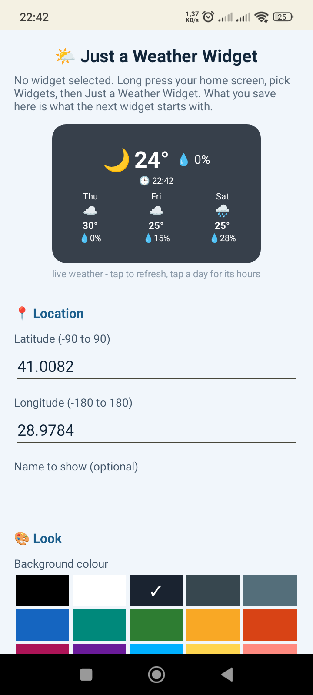

# Just a Weather Widget


A home screen weather widget for Android. Temperature and rain chance, a forecast strip
for the next few days, and an hour by hour view when you tap a day. No account, no API
key, no permissions beyond internet.

The whole app is one widget plus two small screens. There is no dashboard, no login and
no ads - it shows the weather and gets out of the way.

<p align="center">
  
</p>

## Features

- **Coordinates you type in.** Latitude and longitude are entered while the widget is
  being placed, so it works anywhere without a location permission or a place database.
- **No API key.** Weather comes from [Open-Meteo](https://open-meteo.com), which needs no
  sign-up and no token.
- **Works offline.** The last forecast is stored and drawn again when the network is gone,
  marked with 📴 and the time it was fetched.
- **3 to 7 day strip.** Each day shows the weather emoji, the day's high and the rain chance.
- **Tap a day for its hours.** The detail screen lists every hour of that day with emoji,
  temperature and rain chance, and lets you switch between days. It reads the stored
  forecast, so it opens instantly and also works offline.
- **Everything is configurable per widget**, with a live preview that is the real widget:
  background colour, opacity, text colour, text size, rounded or square corners, °C or °F,
  which parts to show, how many days, and how often to update. Two widgets can watch two
  different places with two different looks.
- **Tiny.** ~29 KB APK, and roughly the same installed, because it is plain Java on the core
  Android classes - no AndroidX, no Kotlin runtime, no support libraries.

## How it works

| Piece | What it does |
|---|---|
| `WeatherWidget` | `AppWidgetProvider`: builds the `RemoteViews`, fills the day strip, wires the taps, and keeps the update alarm |
| `ConfigActivity` | Settings, opened while placing the widget and again whenever the current conditions are tapped. Draws the preview with the widget's own code, so the preview cannot drift from the real thing |
| `DetailActivity` | Hour by hour view of one day, with a day picker |
| `Api` | Open-Meteo request, one retry, and the weather code to emoji mapping |
| `Data` | The stored forecast: the raw response plus when it was fetched and whether it is stale |
| `Cfg` | Per widget settings; widget 0 holds the defaults a new widget starts from |
| `Fmt` | English day and month names whatever the phone's language is, clock in the phone's 12/24 hour setting |

The forecast is stored as the raw Open-Meteo response, so the widget, the day details and
the settings preview all read one copy and all of them keep working with no network.

Updates run from a single `AlarmManager` alarm at the shortest interval any widget asked
for (`updatePeriodMillis` is 0, so this is the only clock). Fetching happens on a background
thread inside `goAsync()`; a failure never blanks the widget, it only flags the reading as
offline.

## Building

The project builds with the portable toolchain in
[`SmallestApk`](https://github.com/muhammetozeski) (JDK + Android SDK + Gradle in one folder,
no internet needed):

```powershell
pwsh -File .\Derle.ps1
```

The signed APK lands in `Publish\JustAWeatherWidget.apk`. `Derle.ps1` uses a shared `API`
folder for the toolchain; point `$API_DIR` at your own copy, or drop the line to use an
`API` folder next to the script.

To build with a normal Android Studio setup instead, open `Proje` as the project. Two
things are deliberate and worth keeping:

- `android:debuggable="true"` in the manifest. Android then runs the app straight from the
  APK (`run-from-apk`) and never writes `oat/base.odex`, `base.vdex` or `base.art`, which is
  what keeps the installed size at roughly the APK size.
- `-x lintVitalRelease` when assembling release, because that lint check fails on a
  debuggable release build.

```powershell
gradle -p Proje assembleRelease -x lintVitalRelease
```

## Installing

```powershell
adb install -r "Publish\JustAWeatherWidget.apk"
```

Then long press the home screen, pick **Widgets**, and choose **Just a Weather Widget**.
The settings open while it is being placed. Opening the app from the launcher edits the
defaults for the next widget instead.

## Data

Weather data from [Open-Meteo](https://open-meteo.com) (free for non-commercial use, no key).
Only latitude, longitude, unit and day count are sent. Nothing else leaves the phone, and the
app stores nothing but its own settings and the last forecast.
